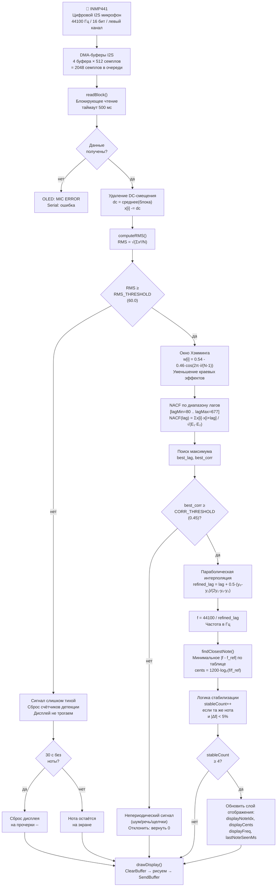

# Документация прошивки: Гитарный тюнер (аппаратная валидация)

> **Платформа:** ESP32 DevKit V1 · PlatformIO · Arduino framework  
> **Файл прошивки:** `src/main.cpp`  
> **Версия документа:** 1.0

---

## Содержание

1. [Архитектура прошивки](#1-архитектура-прошивки)
2. [Функциональная схема обработки аудиосигнала](#2-функциональная-схема-обработки-аудиосигнала)
3. [Схема алгоритма определения основной частоты (NACF)](#3-схема-алгоритма-определения-основной-частоты-nacf)
4. [Детальный разбор кода](#4-детальный-разбор-кода)
   - 4.1 [Заголовки и константы](#41-заголовки-и-константы)
   - 4.2 [Буферы обработки](#42-буферы-обработки)
   - 4.3 [Двухслойная модель состояния](#43-двухслойная-модель-состояния)
   - 4.4 [setup() — инициализация](#44-setup--инициализация)
   - 4.5 [loop() — основной цикл](#45-loop--основной-цикл)
   - 4.6 [initI2S() — настройка микрофона](#46-initi2s--настройка-микрофона)
   - 4.7 [readBlock() — захват аудио](#47-readblock--захват-аудио)
   - 4.8 [computeRMS() — измерение уровня](#48-computeRMS--измерение-уровня)
   - 4.9 [detectPitch() — детекция высоты тона](#49-detectpitch--детекция-высоты-тона)
   - 4.10 [findClosestNote() — определение ноты](#410-findclosestnote--определение-ноты)
   - 4.11 [updateBattery() — измерение батареи](#411-updatebattery--измерение-батареи)
   - 4.12 [drawDisplay() — отрисовка экрана](#412-drawdisplay--отрисовка-экрана)
5. [Таблица порогов и параметров](#5-таблица-порогов-и-параметров)
6. [Известные ограничения и план улучшений](#6-известные-ограничения-и-план-улучшений)

---

## 1. Архитектура прошивки

Прошивка выполняется в одном потоке (`loopTask` Arduino) без FreeRTOS-задач. Это сознательное решение для прошивки аппаратной валидации: простота диагностики важнее оптимизации производительности.

Общая структура:

```
setup()
  └─ Инициализация периферии: Serial → I2C/OLED → ADC → I2S → проверка микрофона

loop()  [~46 мс на итерацию при BLOCK_SIZE=2048, Fs=44100]
  ├─ updateBattery()     [каждые 5 секунд]
  ├─ readBlock()         [блокирующий захват аудио из DMA]
  ├─ DC removal          [удаление постоянной составляющей]
  ├─ computeRMS()        [гейт тишины]
  ├─ detectPitch()       [NACF + параболическая интерполяция]
  ├─ findClosestNote()   [сопоставление с таблицей нот]
  ├─ Логика стабилизации [антидребезг: 4 совпадения подряд]
  ├─ Обновление слоя отображения + таймаут 30 с
  └─ drawDisplay()       [двухбуферная отрисовка на OLED]
```

---

## 2. Функциональная схема обработки аудиосигнала



---

## 3. Схема алгоритма определения основной частоты (NACF)

```mermaid
flowchart TD
    IN["Входной блок float x[2048]\n(после удаления DC)"]

    CALC_LAGS["Вычислить диапазон лагов:\nlagMin = 44100 / 550 = 80\nlagMax = 44100 / 65  = 677\n\nлаг соответствует периоду:\nбольшой лаг = низкая частота"]

    WIN["Применить окно Хэмминга:\nwindowed[i] = x[i] · (0.54 − 0.46·cos(2π·i/2047))\n\nЦель: сгладить края блока,\nуменьшить ложные корреляции\nна малых лагах"]

    ENERGY["Проверить энергию:\nE₀ = Σ windowed[i]²\nЕсли E₀ < 1.0 → вернуть 0\n(блок практически нулевой)"]

    LOOP_START["Цикл по лагам:\nlag = lagMin → lagMax"]

    NACF_FORMULA["Для каждого lag вычислить NACF:\n\nnum  = Σ windowed[i] · windowed[i+lag]\nden1 = Σ windowed[i]²\nden2 = Σ windowed[i+lag]²\ndenom = √(den1 · den2)\n\nNACF(lag) = num / denom"]

    WHY_NACF["Почему нормализация?\nОбычная АКФ зависит от уровня сигнала.\nНАКФ всегда в диапазоне [−1, +1]:\n−1 = полная антикорреляция\n 0 = нет периодичности (шум)\n+1 = идеальная периодичность"]

    FIND_MAX["Найти bestLag и bestCorr:\nmax(NACF) по всему диапазону лагов"]

    THRESHOLD["Порог качества:\nbest_corr < 0.45 → вернуть 0\n\nГитарная струна: 0.55..0.85\nРечь/шум/щелчки: 0.1..0.35\n→ порог 0.45 разделяет два класса"]

    INTERP_WHY["Зачем интерполяция?\nДискретный лаг = ошибка ±0.5 семпла.\nПример: при lag=80 (E4 ≈ 551 Гц)\nΔlag = 0.5 → Δf ≈ 3.4 Гц ≈ 18 центов.\nЦель тюнера ±5 центов → интерполяция обязательна."]

    INTERP_CALC["Параболическая интерполяция:\ny₀ = NACF(bestLag − 1)\ny₁ = NACF(bestLag)     ← пик\ny₂ = NACF(bestLag + 1)\n\nd = 2·y₁ − y₀ − y₂\ndelta = 0.5·(y₀ − y₂) / d\nrefinedLag = bestLag + delta"]

    FREQ_CALC["Вычислить частоту:\nf = 44100 / refinedLag\n\nНапример: refinedLag = 535.3\nf = 44100 / 535.3 = 82.38 Гц → E2"]

    OUT["Вернуть f (Гц)\nили 0.0 если не найдена"]

    IN --> CALC_LAGS --> WIN --> ENERGY --> LOOP_START
    LOOP_START --> NACF_FORMULA --> WHY_NACF --> FIND_MAX
    FIND_MAX --> THRESHOLD
    THRESHOLD -- "corr < 0.45" --> OUT
    THRESHOLD -- "corr ≥ 0.45" --> INTERP_WHY --> INTERP_CALC --> FREQ_CALC --> OUT
```



---

## 4. Детальный разбор кода

### 4.1 Заголовки и константы

```cpp
#include <Arduino.h>       // Базовый Arduino API: millis(), delay(), Serial
#include <driver/i2s.h>    // Низкоуровневый ESP-IDF драйвер I2S (включён в core)
#include <U8g2lib.h>       // Библиотека для OLED: поддержка SSD1306, шрифты, буферизация
#include <Wire.h>          // I2C шина для OLED
#include <math.h>          // cosf(), sqrtf(), log2f(), fabsf()
```

**Почему `driver/i2s.h`, а не Arduino-обёртка?**  
Arduino-обёртка над I2S на ESP32 (класс `I2S`) не поддерживает конфигурацию `I2S_CHANNEL_FMT_ONLY_LEFT` для микрофонов с выбором канала через пин L/R. Прямой вызов ESP-IDF даёт полный контроль над всеми параметрами.

---

**OLED-дисплей:**
```cpp
U8G2_SSD1306_128X64_NONAME_F_HW_I2C u8g2(U8G2_R0,
    /*reset=*/U8X8_PIN_NONE, /*clock=*/22, /*data=*/21);
```
- `F` в имени класса — **full buffer mode**: весь экран (128×64 = 1024 байта) хранится в RAM ESP32 и передаётся на дисплей одним вызовом `sendBuffer()`. Это исключает мерцание при обновлении.
- `U8G2_R0` — без поворота изображения.
- `U8X8_PIN_NONE` — пин RESET не подключён (SSD1306 имеет встроенный power-on reset).

---

**Параметры I2S:**
```cpp
#define SAMPLE_RATE   44100   // Гц
#define BLOCK_SIZE    2048    // семплов = ~46 мс аудио за один блок
#define I2S_BUF_COUNT 4       // количество DMA-буферов в кольце
#define I2S_BUF_LEN   512     // семплов в одном DMA-буфере
```

Соотношение: `I2S_BUF_COUNT × I2S_BUF_LEN = 2048` — ровно один `BLOCK_SIZE`. DMA пишет аудио непрерывно, пока CPU занят вычислениями. `readBlock()` ждёт пока кольцо не заполнится.

---

**Параметры батареи:**
```cpp
#define DIVIDER_RATIO  2.0f   // (10к + 10к) / 10к = 2.0
#define ADC_CORRECTION 1.086f // мультиметр 4.06 В / без-поправки 3.74 В
```

АЦП ESP32 имеет систематическое занижение ~5–10% из-за нелинейности передаточной характеристики. Коэффициент `1.086` откалиброван по конкретному экземпляру платы путём сравнения с мультиметром при V_bat = 4.06 В.

---

### 4.2 Буферы обработки

```cpp
static int16_t  audioBuf[BLOCK_SIZE];    // Сырые данные из I2S DMA (int16)
static float    floatBuf[BLOCK_SIZE];    // Сигнал в float после удаления DC
static float    acfBuf[BLOCK_SIZE];      // Используется только для передачи
                                         // пика NACF из detectPitch() в loop()
static float    windowedBuf[BLOCK_SIZE]; // Сигнал после окна Хэмминга
```

**Критически важно:** все четыре массива объявлены как `static` глобальные переменные. Каждый `float[2048]` занимает **8192 байта**. Стек задачи `loopTask` в Arduino-фреймворке по умолчанию составляет **8192 байта**. Объявление хотя бы одного такого массива как локальной переменной внутри функции приводит к **Stack canary watchpoint triggered** и перезагрузке ESP32.

Глобальные `static` переменные размещаются в сегменте BSS во внутренней DRAM ESP32 (520 KB) — стек при этом не затрагивается.

---

### 4.3 Двухслойная модель состояния

Ключевое архитектурное решение прошивки — разделение состояния на два независимых слоя:

**Слой детекции** (обновляется каждые ~46 мс):
```cpp
static int   lockedNoteIdx = -1;  // -1 = в текущем блоке нота не стабилизирована
static float lockedCents   = 0.0f;
static float detectedFreq  = 0.0f;
static float lastFreq      = 0.0f;   // частота предыдущего блока
static int   stableCount   = 0;      // сколько блоков подряд та же нота
static int   candidateIdx  = -1;     // кандидатная нота в процессе набора счётчика
```

**Слой отображения** (обновляется только при фиксации ноты, держится 30 с):
```cpp
static int       displayNoteIdx = -1;  // -1 = ещё ни одной ноты не поймано
static float     displayCents   = 0.0f;
static float     displayFreq    = 0.0f;
static uint32_t  lastNoteSeenMs = 0;   // millis() последней фиксации
#define NOTE_HOLD_MS 30000UL           // 30 секунд удержания
```

**Зачем два слоя?**  
Если дисплей обновлять напрямую из слоя детекции, нота будет мигать: появляется при атаке струны на ~46 мс, потом пропадает при затухании. Слой отображения решает это: как только нота зафиксирована хотя бы раз, она остаётся на экране и непрерывно обновляет показания центов, пока звучит новый сигнал. После 30 секунд тишины — сброс на прочерки.

---

### 4.4 setup() — инициализация

```cpp
Serial.begin(115200);   // UART для отладочных сообщений
delay(200);             // Пауза: дать USB-Serial стабилизироваться после сброса
```

```cpp
Wire.begin(21, 22);     // I2C: SDA=GPIO21, SCL=GPIO22
u8g2.begin();           // Инициализация SSD1306: I2C-транзакции настройки дисплея
```

```cpp
// Загрузочная заставка на 1.2 секунды
u8g2.clearBuffer();
u8g2.drawStr(...);
u8g2.sendBuffer();
delay(1200);
```
Заставка нужна не только для красоты: она даёт время I2S-периферии и DMA-буферам полностью инициализироваться до первого `readBlock()`.

```cpp
pinMode(BAT_ADC_PIN, INPUT);   // GPIO34 — только вход, без подтяжки
updateBattery();               // Первое измерение напряжения
```

```cpp
initI2S();                     // Настройка I2S-периферии
micOk = readBlock(audioBuf, BLOCK_SIZE);  // Тестовое чтение: жив ли микрофон?
```
Тестовое чтение блокируется на 500 мс. Если микрофон не подключён или неправильно сконфигурирован — `i2s_read()` вернёт 0 байт, `micOk = false`, на OLED появится `MIC ERROR`.

---

### 4.5 loop() — основной цикл

**Шаг 1 — Батарея (каждые 5 с):**
```cpp
if (millis() - batUpdateMs > 5000) {
    updateBattery();
    batUpdateMs = millis();
}
```
Измерение батареи не выполняется каждый цикл, потому что `analogRead()` с 32 усредняемыми отсчётами занимает ~64 мс (32 × delay(1) + время АЦП) — это сравнимо со временем обработки одного блока.

---

**Шаг 2 — Чтение аудио:**
```cpp
micOk = readBlock(audioBuf, BLOCK_SIZE);
if (!micOk) { drawDisplay(); return; }
```
`readBlock()` — блокирующий: CPU ждёт пока DMA не накопит 2048 семплов (~46 мс). Это естественный ритм основного цикла.

---

**Шаг 3 — Удаление DC:**
```cpp
float dcSum = 0.0f;
for (int i = 0; i < BLOCK_SIZE; i++) dcSum += (float)audioBuf[i];
float dc = dcSum / BLOCK_SIZE;
for (int i = 0; i < BLOCK_SIZE; i++) floatBuf[i] = (float)audioBuf[i] - dc;
```
DC-смещение — это ненулевое среднее значение сигнала, которое возникает из-за несовершенства источника питания микрофона и особенностей I2S-интерфейса INMP441. Если не удалить DC, автокорреляция на малых лагах даст ложный пик от постоянной составляющей, что сбивает детектор.

---

**Шаг 4 — RMS-гейт:**
```cpp
float rms = computeRMS(floatBuf, BLOCK_SIZE);
if (rms < RMS_THRESHOLD) {
    stableCount = 0; candidateIdx = -1; lockedNoteIdx = -1;
    // таймаут 30 с и drawDisplay()
    return;
}
```
NACF — дорогостоящая операция: O(N×(lagMax−lagMin)) ≈ O(2048×600) ≈ 1.2 миллиона умножений. Запускать её на тишине бессмысленно. RMS-гейт является первым фильтром: если энергия сигнала ниже порога, уходим в `return` не выполняя NACF.

---

**Шаг 5–6 — Детекция и поиск ноты:**
```cpp
float freq  = detectPitch(floatBuf, BLOCK_SIZE);
float corrPeak = acfBuf[0];   // пик NACF — акфBuf[0] как канал передачи данных
if (freq > 0.0f)
    noteIdx = findClosestNote(freq, &cents);
```

---

**Шаг 7 — Стабилизация:**
```cpp
bool freqClose = fabsf(freq - lastFreq) < (freq * 0.05f);  // ±5%
if (freqClose && noteIdx == candidateIdx) stableCount++;
else { stableCount = 1; candidateIdx = noteIdx; }

if (stableCount >= STABILITY_FRAMES) {
    // Фиксируем ноту в слое детекции
    lockedNoteIdx = noteIdx; lockedCents = cents; detectedFreq = freq;
    // Обновляем слой отображения
    displayNoteIdx = noteIdx; displayCents = cents; displayFreq = freq;
    lastNoteSeenMs = millis();   // Сброс таймера 30 с
}
```
Условие `freqClose` (±5% по частоте) допускает небольшой разброс из-за:
- интонационных особенностей начала звука
- вибрато и неустойчивости при защипе
- численной погрешности NACF на краях диапазона лагов

---

### 4.6 initI2S() — настройка микрофона

```cpp
.mode = I2S_MODE_MASTER | I2S_MODE_RX
```
ESP32 — мастер шины (генерирует BCLK и WS). Только приём (RX): INMP441 — только источник, данные не передаём.

```cpp
.channel_format = I2S_CHANNEL_FMT_ONLY_LEFT
```
INMP441 с L/R=GND передаёт данные в левом канале I2S-фрейма. Правый канал будет нулевым — мы его игнорируем.

```cpp
.communication_format = I2S_COMM_FORMAT_STAND_I2S
```
Стандартный (Philips) I2S: данные MSB сдвинуты на 1 такт после фронта WS. INMP441 поддерживает именно этот формат.

```cpp
.dma_buf_count = 4, .dma_buf_len = 512
```
Всего в DMA-кольце: 4 × 512 = 2048 семплов = ровно один `BLOCK_SIZE`. Пока CPU обрабатывает предыдущий блок, DMA заполняет новый.

---

### 4.7 readBlock() — захват аудио

```cpp
esp_err_t err = i2s_read(I2S_PORT, buf,
                          n * sizeof(int16_t),
                          &bytesRead,
                          pdMS_TO_TICKS(500));
```
`pdMS_TO_TICKS(500)` — таймаут в тиках FreeRTOS (500 мс). При нормальной работе 2048 семплов заполняются за ~46 мс, поэтому запас более чем достаточен. Истечение таймаута означает аппаратную проблему.

---

### 4.8 computeRMS() — измерение уровня

```cpp
float sum = 0.0f;
for (int i = 0; i < n; i++) sum += buf[i] * buf[i];
return sqrtf(sum / (float)n);
```
RMS (Root Mean Square) = среднеквадратическое значение сигнала. Это физически корректная мера уровня звукового сигнала, пропорциональная его мощности. В отличие от пикового значения, RMS устойчив к единичным выбросам.

При INMP441 с 16-битным АЦП: тишина даёт RMS ≈ 5–20 (шум квантования), гитарная струна вблизи — RMS 300–3000, дальнее расстояние — RMS 60–300.

---

### 4.9 detectPitch() — детекция высоты тона

Это центральная и самая вычислительно нагруженная функция прошивки.

**Почему NACF, а не FFT?**

Гитарная струна — не чистый синус. Её спектр содержит фундаментальную частоту f₀ плюс обертоны f₀×2, f₀×3, f₀×4... Причём амплитуда обертонов нередко превышает амплитуду фундаментала (особенно у толстых струн E2, A2). FFT-детектор, выбирающий просто максимальный пик, определит обертон, а не фундаментал.

NACF работает с периодом сигнала напрямую: если сигнал имеет период T семплов, то NACF имеет максимум при лаге = T, независимо от соотношения амплитуд гармоник.

**Диапазон лагов:**
```cpp
int lagMin = (int)(44100 / 550) = 80;   // FREQ_MAX = 550 Гц (выше E4)
int lagMax = (int)(44100 / 65)  = 677;  // FREQ_MIN = 65 Гц  (ниже E2)
```
Лаг и частота связаны обратной зависимостью: лаг = Fs / f.

**Окно Хэмминга:**
```cpp
w[i] = 0.54 - 0.46 * cos(2π * i / (N-1))
```
Без окна края блока создают ложные корреляции (сигнал резко обрывается на границах, как будто там происходит переход). Окно Хэмминга плавно обнуляет края, оставляя центр нетронутым. Коэффициенты 0.54/0.46 — оптимальный компромисс между подавлением боковых лепестков и уширением главного лепестка.

**Формула NACF:**
```
NACF(τ) = Σ[x(t)·x(t+τ)] / √(Σ[x(t)²] · Σ[x(t+τ)²])
```
Числитель — корреляция сигнала с его сдвинутой копией.  
Знаменатель — нормировка на геометрическое среднее локальных энергий.  
Результат: от -1 до +1 независимо от уровня сигнала.

**Параболическая интерполяция:**

Максимум NACF находится с дискретной точностью ±0.5 семпла. При lagMin=80 это даёт ошибку:
```
Δf ≈ Fs × Δlag / lag² = 44100 × 0.5 / 80² ≈ 3.4 Гц ≈ 18 центов
```
Цель тюнера — ±5 центов. Без интерполяции недостижимо.

Интерполяция аппроксимирует пик NACF параболой по трём точкам и находит точную вершину:
```
delta = 0.5 × (y₀ - y₂) / (2·y₁ - y₀ - y₂)
refined_lag = best_lag + delta
```

---

### 4.10 findClosestNote() — определение ноты

```cpp
for (int i = 0; i < NUM_NOTES; i++) {
    float d = fabsf(freq - NOTES[i].freq);
    if (d < bestD) { bestD = d; best = i; }
}
*centsOut = 1200.0f * log2f(freq / NOTES[best].freq);
```

Поиск ближайшей ноты по минимальному линейному расстоянию в Гц. После нахождения ноты вычисляется отклонение в **центах** — логарифмической единице, равной 1/100 полутона:

```
cents = 1200 × log₂(f_detected / f_reference)
```

Логарифмическая шкала используется потому, что музыкальное восприятие высоты тона логарифмично: удвоение частоты воспринимается как октава (+1200 центов), независимо от абсолютного значения.

Знак: положительный → струна **завышена** (sharp, надо ослабить колок), отрицательный → **занижена** (flat, надо натянуть).

---

### 4.11 updateBattery() — измерение батареи

```cpp
// Усреднение 32 отсчётов с задержкой 1 мс между ними
long sum = 0;
for (int i = 0; i < 32; i++) { sum += analogRead(BAT_ADC_PIN); delay(1); }
float adcRaw = (float)(sum / 32);

float adcV   = adcRaw / 4095.0f * 3.3f;         // код АЦП → напряжение на пине
batteryV     = adcV * 2.0f * 1.086f;             // пин → напряжение батареи с поправкой
```

**Цепочка пересчёта:**
```
V_adc_pin = ADC_code / 4095 × 3.3 В
V_battery = V_adc_pin × DIVIDER_RATIO × ADC_CORRECTION
          = V_adc_pin × 2.0 × 1.086
```

**Процент заряда** вычисляется линейной интерполяцией:
```
% = (V_bat - 3.0) / (4.2 - 3.0) × 100
```
Это упрощение: реальная разрядная кривая Li-ion нелинейна (пологое плато при 3.7–3.9 В). Для финальной прошивки следует использовать табличный метод или интегрирование тока.

---

### 4.12 drawDisplay() — отрисовка экрана

**Двухбуферный режим U8g2:**
```cpp
u8g2.clearBuffer();   // Очистка внутреннего RAM-буфера (не физического экрана)
// ... команды рисования (только пишут в RAM) ...
u8g2.sendBuffer();    // Единая I2C-транзакция: весь буфер → SSD1306
```
Экран обновляется атомарно — никакого мерцания или частичного обновления.

**Три режима отображения:**

1. `!micOk` → экран ошибки `MIC ERROR`
2. `displayNoteIdx < 0` → прочерки `--` + `-- Hz` + нейтральный индикатор `    |    `
3. `displayNoteIdx >= 0` → полный тюнерный интерфейс

**Стрелочный индикатор:**
```
"    |    "  → IN TUNE  (|cents| ≤ 5)
"   <|    "  → TOO LOW  (−20 < cents < −5)
"<< <|    "  → TOO LOW  (cents < −20)
"    |>   "  → TOO HIGH (+5 < cents < +20)
"    |> >>"  → TOO HIGH (cents > +20)
```

---

## 5. Таблица порогов и параметров

| Константа | Значение | Смысл | Как изменить |
|---|---|---|---|
| `SAMPLE_RATE` | 44100 Гц | Частота дискретизации | Не менять (задана INMP441) |
| `BLOCK_SIZE` | 2048 | Семплов на блок (~46 мс) | Уменьшить → быстрее отклик, хуже точность для низких нот |
| `RMS_THRESHOLD` | 60.0 | Минимальный RMS для запуска NACF | ↑ если реагирует на шум; ↓ если не ловит тихие струны |
| `CORR_THRESHOLD` | 0.45 | Минимальный пик NACF | ↑ если ложные ноты; ↓ если не определяет |
| `STABILITY_FRAMES` | 4 | Блоков подряд для фиксации | ↓ (2–3) быстрее; ↑ (5–6) стабильнее |
| `IN_TUNE_CENTS` | 5.0 | Порог "в строю" (центы) | Стандарт тюнера; не менять |
| `CLOSE_CENTS` | 20.0 | Одна vs двойная стрелка | По вкусу |
| `NOTE_HOLD_MS` | 30000 | Мс удержания ноты на экране | Под задачу |
| `ADC_CORRECTION` | 1.086 | Поправка АЦП батареи | Перекалибровать по мультиметру |
| `DIVIDER_RATIO` | 2.0 | Коэффициент делителя напряжения | Менять если другие резисторы |
| `FREQ_MIN` | 65 Гц | Нижняя граница поиска | Не менять без проверки |
| `FREQ_MAX` | 550 Гц | Верхняя граница поиска | Не менять без проверки |

---

## 6. Известные ограничения и план улучшений

| # | Ограничение | Причина | Решение в финальной прошивке |
|---|---|---|---|
| 1 | Всё в одном потоке | Упрощение для валидации | Вынести NACF в FreeRTOS-задачу с высоким приоритетом |
| 2 | Линейная шкала заряда батареи | Li-ion имеет нелинейную кривую разряда | Таблица SoC или интегрирование тока (INA219) |
| 3 | `ADC_CORRECTION` — константа | АЦП ESP32 имеет разброс между экземплярами | `esp_adc_cal_characterize()` для автокалибровки |
| 4 | NACF без FFT-ускорения | Достаточно быстро на ESP32 (~15 мс) | В финале: NACF через FFT (теорема Винера-Хинчина) |
| 5 | Нет power management | Прошивка валидации | Deep sleep между блоками, wake по таймеру |
| 6 | Фиксированный порог RMS | Зависит от расстояния до гитары | Адаптивный порог (скользящее среднее шума) |